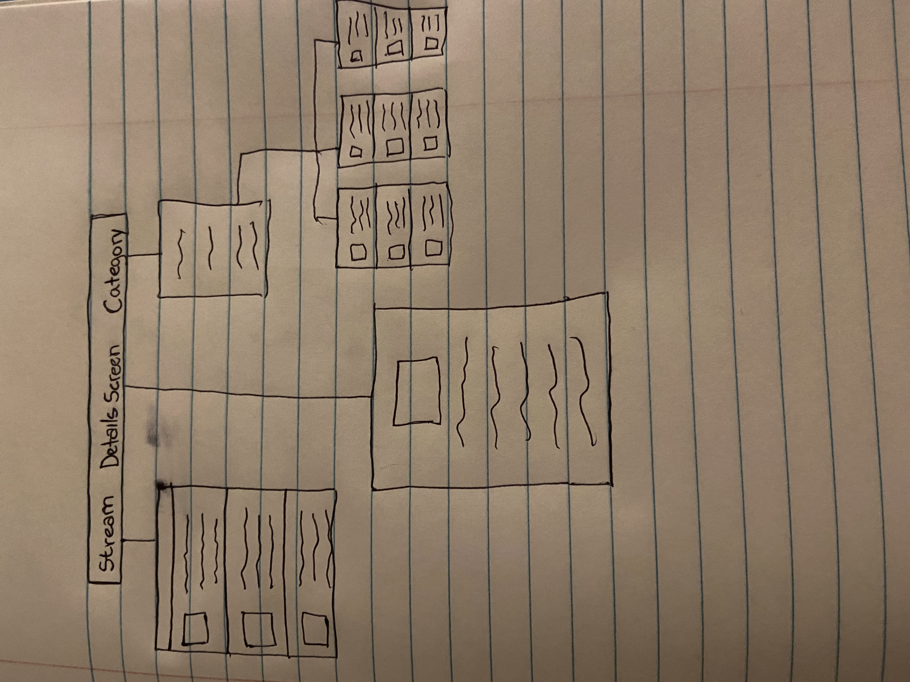

Group Project - README Template
===

# MWA

## Table of Contents
1. [Overview](#Overview)
1. [Product Spec](#Product-Spec)
1. [Wireframes](#Wireframes)
2. [Walkthrough](#Walkthrough)

## Overview
### Description
The most wanted App is a tool designed to help track down criminals and recover victims. The app provides information issued by the FBI in a user-friendly interface.

### App Evaluation
- **Category:** Security
- **Mobile:** This app would be mainly used on mobile devices.
- **Story:** Display monst wanted people on the FBI list divided by category.
- **Market:** Anyone who is willing to help track down criminals.
- **Habit:** This app could be used to track down criminals and help to recover victims by sending tips or any type of information.
- **Scope:** First we would develop the app just for display diving the crimes into categories, in the future the app could be used to search names and show locations on map

## Product Spec

### 1. User Stories (Required and Optional)

**Required Must-have Stories**

* User can see top 10 most-wanted lists for different crimes.
* User can choose specific categories of most-wanted criminals.
* User can see individuals detailed information by clicking in the Poster button.
* User can access FBI's website through the app

### 2. Screen Archetypes

* Stream
   * User can view different categories of crimes to be chosen.

* Categories
   * User can see the ten most recent added criminals to the FBI's most wanted list and their information
   
* Detail
   * By clicking on an individual's poster button the user will be able to see a poster with detailed information about the criminal 
   
### 3. Navigation

**Flow Navigation** (Screen to Screen)

* User can navigate between screen by clicking in pictures and buttons
   * Home => Category
   
   * OR
   
   * Categories => Detail

## Wireframes

#### Main_Page
   | Property      | Type     | Description |
   | ------------- | -------- | ------------|
   | typeOfCrime   | String   | categories of crimes|
   | picture       | img      | clickable image |
   | name of the app | String   | name of the app |
   | logo   | img  | FBI's logo |
  
  
### Networking
- Home screen 
  - Provides options of different lists
- Category list
  - (Read/Get) Query all the list of most recent criminals for that type of crime
  

   

